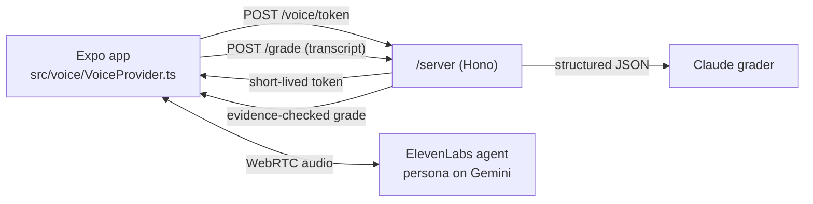

# HardTalk

Practise the conversation before you have it.

HardTalk is a voice roleplay app for difficult workplace conversations. You pick a situation, say it out loud to an AI colleague who pushes back, and get a scorecard that quotes your own words back to you. Then you try again and see the score move.


## See it in 60 seconds

```sh
pnpm install
pnpm dev        # then press w for the browser, or scan the QR code with Expo Go
```

That is mock mode, and it needs no API keys, no microphone and no network. It replays recorded conversations through the same screens, captions and scorecard as the live app, and a yellow banner says so on every screen. Node 20 and pnpm 10 are the only requirements.

## What happens in a session

1. Pick one of three conversations: a teammate's PR has blocked the release for three days, your manager wants you on an extra project, or your PM added scope mid-sprint.
2. Pick how hard the other person pushes back: L1 cooperative, L2 defensive, L3 deflecting.
3. Talk. The persona has a goal and a hidden objection, and ends the call when your ask has been answered or after six turns. Captions run for both speakers.
4. Read the scorecard. Clarity, Empathy, Ask made and Boundary held are each scored 1 to 4, and every score above 1 quotes something you actually said, with one line to try next time.
5. Retry. The scorecard shows each score before and after, side by side.

## How it works



The app never holds a provider key. `/server` mints a short-lived ElevenLabs conversation token and runs the grader. The persona and the grader are deliberately different model families (Gemini inside ElevenLabs, Claude for grading), so the grader never marks its own roleplay.

Scores have to be grounded. `src/grading/evidence.ts` checks that every quote behind a score above 1 appears word for word in one of the user's turns. The grader gets one retry with the bad quotes named; anything still ungrounded is lowered to 1 and the scorecard says why. Mock mode runs its recorded grades through the same check.

## Where to look

| Path | What is there |
| --- | --- |
| `data/rubrics/*.yaml` | The four rubrics, with anchored 1–4 descriptors citing SBI, Nonviolent Communication and Crucial Conversations |
| `data/scenarios/*.yaml` | Each persona's goal, hidden objection, tone, L1–L3 behaviour and stop condition |
| `data/prompts/` | The persona prompt template and the grader instructions with weak, medium and strong calibration examples |
| `src/grading/` | Grade schema, evidence gate, retry-then-downgrade orchestration, prompt assembly |
| `src/voice/` | `VoiceProvider` interface, the ElevenLabs provider and the mock replay |
| `server/` | Token minting and grading, under 200 lines |
| `app/` | Four screens: scenarios, brief, live session, scorecard |

Rubrics, scenarios and prompts are YAML so they can be read and reviewed without reading code. The app and the server validate them against the same zod schemas, and `pnpm test` fails if any file drifts from its schema.

## Running it for real

Live mode needs a development build on a phone (Expo Go cannot load the WebRTC modules), an ElevenLabs agent, and an Anthropic API key. The full walkthrough is in [docs/DEVICE.md](docs/DEVICE.md). In short:

```sh
cp server/.env.example server/.env   # add ANTHROPIC_API_KEY, ELEVENLABS_API_KEY, ELEVENLABS_AGENT_ID
pnpm server                          # grading + token minting on :8787
pnpm android                         # builds and installs the dev build
```

## Checks

```sh
pnpm test        # unit tests: schemas, data files, evidence gate, grader retry, server routes, both voice providers
pnpm lint        # zero warnings
pnpm typecheck   # TypeScript strict
```

## How this was built

HardTalk is my entry for the RevenueCat Shipaton 2026 Next Gen award. I built it with Claude Code in a loop: build one phase, then a separate reviewer pass acting as a tired, hostile judge clones the repo, tries to run it and scores it against the four judging criteria. The reviews are in [`review/`](review/), every finding is in [DEFECTS.md](DEFECTS.md), the score history is in [SCORECARD.md](SCORECARD.md), and [PLAN.md](PLAN.md) is re-planned from the scores after each round. [CLAUDE.md](CLAUDE.md) holds the rules the loop follows.

## Licence

MIT. See [LICENSE](LICENSE).
