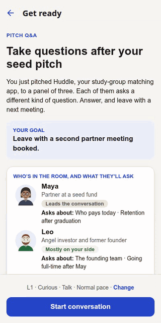
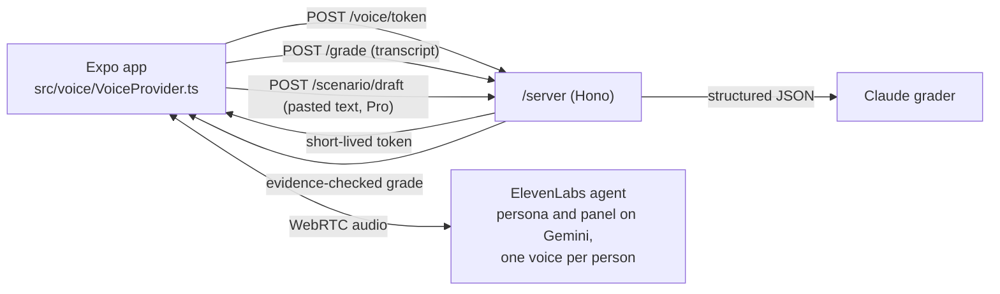

# HardTalk

Practise the conversation before you have it.

HardTalk is the practice panel you don't have. It is for the spoken moments you only get one shot at: your first job interview, the Q&A after your first pitch, a debate, or telling a teammate their PR is blocking the release. It is built for students and people early in their careers, who rarely have a room of experienced people to rehearse with.

You say it out loud to a room of AI personas who push back, each with their own face, voice and line of questioning. Then you get a scorecard that quotes your own words as the evidence for every score, and one better line to try. You try again and see the score move.

- **Every score shows its evidence.** A score above 1 must quote something you actually said, and code (not the model) throws out any quote you didn't say.
- **The rubrics are open.** Fourteen anchored rubrics in `data/rubrics/`, each citing a named framework (SBI, Nonviolent Communication, Crucial Conversations, STAR, the Pyramid Principle, SPIN Selling, Toulmin and more).
- **A panel, not a chatbot.** An investor who likes you, one who doubts the model, an advisor who asks what stops a copycat. The brief tells you what each will ask about.
- **See who you won over.** Each person on the panel judges only the skills they care about: the investor weighs your evidence and how you handle objections, the engineer weighs your specifics. The scorecard shows who you won over, who is unsure and who is unconvinced, worked out from the same evidence-checked scores, and who changed their mind after your retry.
- **Bring the real one (Pro).** Paste the job posting you are applying to, your pitch, or the motion, and HardTalk drafts a panel for that exact moment: who is in the room, what each will push on, and what you need to leave with.
- **The whole loop works with a screen reader and no audio**, and saying "stop" ends it at once, unscored.



## Who it is for, and why it matters

**Who.** Final-year students and new graduates before their first interviews, student founders before their first investor Q&A, and new graduates before their first hard conversation at work. That is about 1.97 million US bachelor's graduates a year ([NCES, 2022–23](https://nces.ed.gov/programs/digest/d24/tables/dt24_322.20.asp)) and about 10.7 million graduates a year in India ([AISHE 2021–22](https://www.pib.gov.in/PressReleasePage.aspx?PRID=1999713)).

**The pain.** Hiring now takes about 20 interviews per hire, up from 14 in 2021 ([Gem, 2025](https://www.gem.com/blog/10-takeaways-from-the-2025-recruiting-benchmarks-report)). Interview anxiety goes with lower interview performance (r = −.19 across studies; [Powell, Stanley & Brown, 2018](https://psycnet.apa.org/fulltext/2018-44232-001.pdf)), and a third of Americans fear public speaking ([Chapman, 2025](https://www.chapman.edu/wilkinson/research-centers/babbie-center/_files/2025/Key-Findings-Survey-of-America-Fears-2025.pdf)).

**What people use today.** A career coach (about $207 an hour, [Career Sidekick](https://careersidekick.com/career-coach-cost/)), paid mock interviews, a friend, or nothing. Google's free Interview Warmup was retired in April 2026 ([reported by Four Leaf](https://four-leaf.ai/blog/google-interview-warmup)), and Poised is shutting down on 8 October 2026 ([notice on its site](https://www.poised.com/)).

| | Focus | Price (Sept 2026) | Where HardTalk differs |
| --- | --- | --- | --- |
| [Yoodli](https://yoodli.ai/pricing) | Speech coaching and AI roleplays | Free (5 sessions), $8–20/mo | A panel with different stances, and scores that quote you |
| [Final Round AI](https://www.finalroundai.com/) | A live copilot during real interviews | From $25/mo | Builds the skill before, instead of feeding answers during |
| [VirtualSpeech](https://virtualspeech.com/pricing) | VR soft-skills courses | $45/mo | Mobile, student-priced, open rubrics |
| [PitchDesk](https://pitchdesk.in/) | AI investor panel for pitches | Per-minute packs | Also interviews, debates and work; evidence-checked scores |
| [Big Interview](https://www.biginterview.com/pricing/personal) | Video lessons and AI feedback | $39 a month | A live, voiced conversation that pushes back |

**Business model.** Free: every built-in scenario and three graded sessions. Pro through RevenueCat: a **One-week pass** ($2.99 a week, renewing until you cancel) for one real conversation coming up, because practice comes in bursts; monthly ($4.99) and annual ($29.99) for people who keep practising. That is below the Education category's median prices ($9.99 a month, $44.99 a year) in RevenueCat's [State of Subscription Apps 2026](https://www.revenuecat.com/state-of-subscription-apps-2026-education), which also puts freemium apps at about 2.1% of downloads converting to paid within 35 days: the number to beat.

**Closing the loop.** After you practise one of your own scenarios, the app asks how the real conversation went (it went well, mixed, not this time), and your progress shows it beside your scores. It stays on the device.

**What is not proven yet.** There are no users, no revenue and no measured cost per live session: nothing has run live on a phone (see [DEFECTS.md](DEFECTS.md)). Simulated interview practice has raised job-offer odds in studies of adjacent populations ([pooled analysis, 2024](https://pmc.ncbi.nlm.nih.gov/articles/PMC11232528/)); HardTalk has not been measured, so it claims only practice, not offers.

## See it in 60 seconds

```sh
pnpm install
pnpm dev        # then press w for the browser, or scan the QR code with Expo Go
```

That is mock mode, and it needs no API keys, no microphone and no network. It replays recorded conversations through the same screens, captions and scorecard as the live app, reads each persona's lines aloud with the device's own speech engine at their own pitch, and a yellow banner says so on every screen. Node 20 and pnpm 10 are the only requirements.

## What happens in a session

1. Pick a track and a conversation:

   | Track | Built-in conversation | Who is in the room | Scored on |
   | --- | --- | --- | --- |
   | Workplace | A teammate's PR is blocking the release; saying no to your manager's extra project; pushing back on mid-sprint scope | One colleague | Clarity (SBI), Empathy (NVC), Ask made, Boundary held (Crucial Conversations) |
   | Pitch Q&A | Questions after your seed pitch | Maya (who pays, retention), Leo (the team), Kenji (what stops a copycat) | Answered first, Evidence, Objections, Next step (SPIN Selling) |
   | Interview | Your first engineering interview; a summer internship at a startup | Priya (a time it failed), Tom (the technical why), Grace (why this team); Ravi (what you actually built), Nora (how you knew what users wanted), Ben (why a startup) | Answered first, Structured story (STAR), Evidence, Ownership |
   | Debate | AI assistants in programming exams | Daniel (against), Aisha (moderator), Mateo (how would it be checked) | Clear claim, Rebuttal, Fair to the other side, Held your ground |

2. Read the brief: who is in the room, whose side they are on, and what each will ask about. Pick how hard they push back: L1, L2 or L3. The lead persona's face changes with the level.
3. Talk, or type if you would rather not use audio. Everyone has a goal, the lead has a hidden objection, and the conversation ends when it reaches its stop condition or after six of your turns. Captions run for every speaker, under their name and face. Saying or typing "stop" ends it at once, unscored.
4. Read the scorecard. The track's four rubrics are each scored 1 to 4, every score above 1 quotes something you actually said, and each comes with one line to try next time. Your key line (your ask, your close, your result or your claim) is pulled out at the top.
5. Retry. The scorecard shows each score before and after, side by side.

Three graded sessions are free, in any track. Pro (the RevenueCat `pro` entitlement) adds unlimited grading, progress history, and your own scenarios: paste the real job posting, pitch or motion and a panel is drafted for it (`POST /scenario/draft`, prompt in `data/prompts/drafter.yaml`), or describe it in five answers. The paywall opens in exactly two places: starting a fourth graded session, and tapping "Create your own scenario". At the session limit its copy names the conversation you are starting and how your score has moved on it ("Keep practising 'Your teammate's PR is blocking the release'. Your score on it so far: 7 → 14 out of 16."); at "Create your own scenario" it says why you would write one. The words come from `data/paywall.yaml` and reach RevenueCat's paywall as custom variables. The free sessions are counted on the device, so deleting your history does not reset them; reinstalling does, because there are no accounts. Restore purchases is on the home screen and on the paywall.

## How it works



The app never holds a provider key. `/server` mints a short-lived ElevenLabs conversation token and runs the grader. The persona and the grader are deliberately different model families (Gemini inside ElevenLabs, Claude for grading), so the grader never marks its own roleplay.

Scores have to be grounded. `src/grading/evidence.ts` checks that every quote behind a score above 1 appears in one of the user's own turns as whole words, and is either a full sentence or at least three words long. The grader gets one retry with the bad quotes named; anything still ungrounded is lowered to 1 and the scorecard says why. Mock mode runs its recorded grades through the same check. A recorded grade only describes the recorded lines, so a typed mock conversation in your own words is not scored at all, and does not use a free session; only live mode grades your own words.

## Where to look

| Path | What is there |
| --- | --- |
| `data/tracks/*.yaml` | The four tracks: the room the persona is in, what the grader grades, the four rubrics and the key line |
| `data/rubrics/*.yaml` | Fourteen rubrics with anchored 1–4 descriptors, each citing a named framework and its source |
| `data/scenarios/*.yaml` | Each persona's goal, hidden objection, tone, face, voice, what they ask about, L1–L3 behaviour and stop condition, plus the panel |
| `data/prompts/` | The persona prompt template and the grader instructions with weak, medium and strong calibration examples |
| `src/grading/` | Grade schema, evidence gate, retry-then-downgrade orchestration, prompt assembly |
| `src/voice/` | `VoiceProvider` interface, the ElevenLabs provider (with panel voices split by speaker) and the mock replay read aloud on the device |
| `src/ui/Face.tsx` | The drawn persona faces: SVG, no image assets, blinking and talking, stilled by Reduce Motion |
| `src/purchases/` | RevenueCat entitlement, paywall with scenario-aware custom variables, restore, and the two paywall gates |
| `src/safety/`, `data/safety.yaml` | Stop word, distress exit, crisis resources, disclaimer |
| `server/` | Token minting, grading, panel drafting, safety refusal and a per-client rate limit, about 450 lines |
| `evals/` | 30 hand-labelled workplace conversations and `pnpm eval`, which measures the grader against them ([EVALS.md](EVALS.md)); the other tracks have no gold set yet |
| `app/` | Screens: scenarios, brief, live session, scorecard, paywall (mock mode), progress history, your own scenario |

Rubrics, scenarios and prompts are YAML so they can be read and reviewed without reading code. The app and the server validate them against the same zod schemas, and `pnpm test` fails if any file drifts from its schema.

## Safety and accessibility

The persona pushes back professionally and never more than the level allows. Every line you say is checked for distress on the device, and in live mode again on the server by a model; either one ends the roleplay, skips scoring and shows crisis lines. The persona and the grader are told to watch for it too, and `/grade` refuses to score a flagged transcript. Saved transcripts are kept only on the device and can be deleted; in live mode the conversation is sent to ElevenLabs to run it and to Anthropic to grade it. Details and limits: [SAFETY.md](SAFETY.md).

Everything can be done by typing with a screen reader on and no audio. Turn changes are announced with the persona muted while the screen reader talks, there are haptics on each turn, a pace setting for the persona's voice, and contrast is checked by tests. The WCAG 2.2 mapping, including what is not covered yet, is in [ACCESSIBILITY.md](ACCESSIBILITY.md).

## Running it for real

Live mode needs a development build on a phone (Expo Go cannot load the WebRTC modules), an ElevenLabs agent, an Anthropic API key and a RevenueCat Test Store key. The walkthroughs are [docs/DEVICE.md](docs/DEVICE.md) and [docs/REVENUECAT.md](docs/REVENUECAT.md). In short:

```sh
cp server/.env.example server/.env   # add ANTHROPIC_API_KEY, ELEVENLABS_API_KEY, ELEVENLABS_AGENT_ID
cp .env.example .env.local           # set EXPO_PUBLIC_MOCK=0, your computer's LAN IP, the RevenueCat test_ key
pnpm start:server                    # grading + token minting on :8787
pnpm android                         # builds and installs the dev build in live mode
```

## Checks

```sh
pnpm test        # unit tests: schemas, data files, evidence gate, grader retry, server routes, both voice providers
pnpm lint        # zero warnings
pnpm typecheck   # TypeScript strict
pnpm eval        # grader vs hand labels: kappa, agreement, run-to-run stability (needs a key; --baseline does not)
```

[EVALS.md](EVALS.md) explains the gold set and the metrics, and is explicit about what has not been run yet.

## How this was built

HardTalk is my entry for the RevenueCat Shipaton 2026 Next Gen award. I built it with Claude Code in a loop: build one phase, then a separate reviewer pass acting as a tired, hostile judge clones the repo, tries to run it and scores it against the four judging criteria. The reviews are in [`review/`](review/), every finding is in [DEFECTS.md](DEFECTS.md), the score history is in [SCORECARD.md](SCORECARD.md), and [PLAN.md](PLAN.md) is re-planned from the scores after each round. [CLAUDE.md](CLAUDE.md) holds the rules the loop follows.

## Licence

MIT. See [LICENSE](LICENSE).
