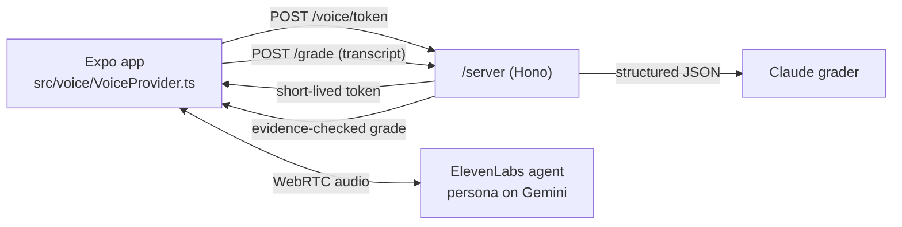

# HardTalk

Practise the conversation before you have it.

HardTalk is a voice roleplay app for difficult workplace conversations. You pick a situation, say it out loud to an AI colleague who pushes back, and get a scorecard that quotes your own words back to you. Then you try again and see the score move.


## See it in 60 seconds

```sh
pnpm install
pnpm dev        # then press w for the browser, or scan the QR code with Expo Go
```

That is mock mode, and it needs no API keys, no microphone and no network. It replays recorded conversations through the same screens, captions and scorecard as the live app, and a yellow banner says so on every screen. Node 20 and pnpm 10 are the only requirements.

## What happens in a session

1. Pick one of three conversations: a teammate's PR has blocked the release for three days, your manager wants you on an extra project, or your PM added scope mid-sprint.
2. Pick how hard the other person pushes back: L1 cooperative, L2 defensive, L3 deflecting.
3. Talk, or type if you would rather not use audio. The persona has a goal and a hidden objection, and ends the call when your ask has been answered or after six turns. Captions run for both speakers. Saying or typing "stop" ends it at once, unscored.
4. Read the scorecard. Clarity, Empathy, Ask made and Boundary held are each scored 1 to 4, and every score above 1 quotes something you actually said, with one line to try next time.
5. Retry. The scorecard shows each score before and after, side by side.

Three graded sessions are free. Pro (the RevenueCat `pro` entitlement) adds unlimited grading, your own scenarios and progress history. The paywall opens in exactly two places: starting a fourth graded session, and tapping "Create your own scenario". At the session limit its copy names the conversation you are starting and how your score has moved on it ("Keep practising 'Your teammate's PR is blocking the release'. Your score on it so far: 7 → 14 out of 16."); at "Create your own scenario" it says why you would write one. The words come from `data/paywall.yaml` and reach RevenueCat's paywall as custom variables. The free sessions are counted on the device, so deleting your history does not reset them; reinstalling does, because there are no accounts. Restore purchases is on the home screen.

## How it works



The app never holds a provider key. `/server` mints a short-lived ElevenLabs conversation token and runs the grader. The persona and the grader are deliberately different model families (Gemini inside ElevenLabs, Claude for grading), so the grader never marks its own roleplay.

Scores have to be grounded. `src/grading/evidence.ts` checks that every quote behind a score above 1 appears in one of the user's own turns as whole words, and is either a full sentence or at least three words long. The grader gets one retry with the bad quotes named; anything still ungrounded is lowered to 1 and the scorecard says why. Mock mode runs its recorded grades through the same check. You can watch it in typed mode: rewrite a prefilled line and any score that depended on it drops to 1, because a recorded grade has no evidence for words it never saw. Only live mode can grade a better line.

## Where to look

| Path | What is there |
| --- | --- |
| `data/rubrics/*.yaml` | The four rubrics, with anchored 1–4 descriptors citing SBI, Nonviolent Communication and Crucial Conversations |
| `data/scenarios/*.yaml` | Each persona's goal, hidden objection, tone, L1–L3 behaviour and stop condition |
| `data/prompts/` | The persona prompt template and the grader instructions with weak, medium and strong calibration examples |
| `src/grading/` | Grade schema, evidence gate, retry-then-downgrade orchestration, prompt assembly |
| `src/voice/` | `VoiceProvider` interface, the ElevenLabs provider and the mock replay |
| `src/purchases/` | RevenueCat entitlement, paywall with scenario-aware custom variables, restore, and the two paywall gates |
| `src/safety/`, `data/safety.yaml` | Stop word, distress exit, crisis resources, disclaimer |
| `server/` | Token minting, grading, safety refusal and a per-client rate limit, about 250 lines |
| `evals/` | 30 hand-labelled conversations and `pnpm eval`, which measures the grader against them ([EVALS.md](EVALS.md)) |
| `app/` | Screens: scenarios, brief, live session, scorecard, paywall (mock mode), progress history, your own scenario |

Rubrics, scenarios and prompts are YAML so they can be read and reviewed without reading code. The app and the server validate them against the same zod schemas, and `pnpm test` fails if any file drifts from its schema.

## Safety and accessibility

The persona pushes back professionally and never more than the level allows. When the app recognises a distress signal it ends the roleplay, skips scoring and shows crisis lines, and the server refuses to score such a transcript too. The persona is also told to stop on distress; that stop is never scored either, and its screen links to the same crisis lines. Saved transcripts are kept only on the device and can be deleted; in live mode the conversation is sent to ElevenLabs to run it and to Anthropic to grade it. Details and limits: [SAFETY.md](SAFETY.md).

Everything can be done by typing with a screen reader on and no audio. Turn changes are announced with the persona muted while the screen reader talks, there are haptics on each turn, a pace setting for the persona's voice, and contrast is checked by tests. The WCAG 2.2 mapping, including what is not covered yet, is in [ACCESSIBILITY.md](ACCESSIBILITY.md).

## Running it for real

Live mode needs a development build on a phone (Expo Go cannot load the WebRTC modules), an ElevenLabs agent, an Anthropic API key and a RevenueCat Test Store key. The walkthroughs are [docs/DEVICE.md](docs/DEVICE.md) and [docs/REVENUECAT.md](docs/REVENUECAT.md). In short:

```sh
cp server/.env.example server/.env   # add ANTHROPIC_API_KEY, ELEVENLABS_API_KEY, ELEVENLABS_AGENT_ID
cp .env.example .env.local           # set EXPO_PUBLIC_MOCK=0, your computer's LAN IP, the RevenueCat test_ key
pnpm start:server                    # grading + token minting on :8787
pnpm android                         # builds and installs the dev build in live mode
```

## Checks

```sh
pnpm test        # unit tests: schemas, data files, evidence gate, grader retry, server routes, both voice providers
pnpm lint        # zero warnings
pnpm typecheck   # TypeScript strict
pnpm eval        # grader vs hand labels: kappa, agreement, run-to-run stability (needs a key; --baseline does not)
```

[EVALS.md](EVALS.md) explains the gold set and the metrics, and is explicit about what has not been run yet.

## How this was built

HardTalk is my entry for the RevenueCat Shipaton 2026 Next Gen award. I built it with Claude Code in a loop: build one phase, then a separate reviewer pass acting as a tired, hostile judge clones the repo, tries to run it and scores it against the four judging criteria. The reviews are in [`review/`](review/), every finding is in [DEFECTS.md](DEFECTS.md), the score history is in [SCORECARD.md](SCORECARD.md), and [PLAN.md](PLAN.md) is re-planned from the scores after each round. [CLAUDE.md](CLAUDE.md) holds the rules the loop follows.

## Licence

MIT. See [LICENSE](LICENSE).
